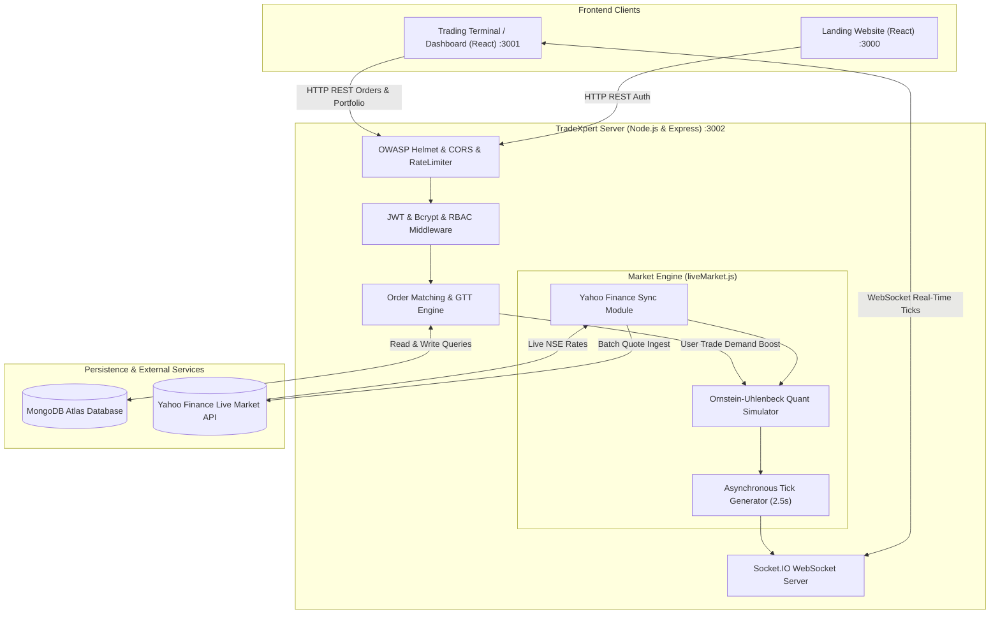

# 🚀 TradeXpert | Institutional-Grade Paper Trading & Terminal Platform

<div align="center">


[](https://opensource.org/licenses/ISC)
[](https://reactjs.org/)
[](https://nodejs.org/)
[](https://expressjs.com/)
[](https://www.mongodb.com/)
[](https://socket.io/)
[](#-security-architecture--hardening-grade-a-9810)
[](#)

**A high-performance, full-stack Fintech Paper Trading & Terminal platform inspired by modern institutional trading desks and Bloomberg Terminal.**  
Delivering real-time Dalal Street market feeds, automated Limit & GTT order matching, an asynchronous institutional Quantitative Simulation engine, and bank-grade application security.

[🌐 Live Landing Platform](https://tradexpert-vq6s.onrender.com) • [📊 Trading Terminal](https://tradexpert-dashboard.onrender.com) • [⚡ Backend API](https://tradexpert-backend-q7pf.onrender.com) • [📖 Bug Report](https://github.com/Shubham-07-creator/TradeXpert/issues)

</div>

---

## 📑 Table of Contents
- [Executive Overview](#-executive-overview)
- [System Architecture](#-system-architecture)
- [Core Innovation & Key Features](#-core-innovation--key-features)
  - [1. Real Dalal Street Feed & Hybrid Quant Engine](#1-real-dalal-street-feed--hybrid-quant-engine)
  - [2. Advanced Order Matching & Execution Engine](#2-advanced-order-matching--execution-engine)
  - [3. Portfolio & Realized/Unrealized Risk Analytics](#3-portfolio--realizedunrealized-risk-analytics)
  - [4. Financial Micro-Interactions ("Wow Factor")](#4-financial-micro-interactions-wow-factor)
  - [5. Admin Command Center & Market Maker Tools](#5-admin-command-center--market-maker-tools)
- [Security Architecture & Hardening (Grade A+ 9.8/10)](#-security-architecture--hardening-grade-a-9810)
- [Mobile-First Responsive Engineering](#-mobile-first-responsive-engineering)
- [Tech Stack](#-tech-stack)
- [Directory Structure](#-directory-structure)
- [Local Setup & Installation](#-local-setup--installation)
- [Environment Variables](#-environment-variables)
- [REST API Reference](#-rest-api-reference)
- [Deployment](#-deployment)
- [Author & Acknowledgments](#-author--acknowledgments)

---

## 💡 Executive Overview

Most stock trading academic projects are limited to static hardcoded JSON files, crude random price generators, or lack realistic market mechanics.

**TradeXpert** is engineered to mirror the architecture of modern Indian neo-brokers and institutional trading desks:
- **Real Market Integration:** Automatically pulls live quotes for **100 NSE Equities** and major benchmark indices (**NIFTY 50** & **SENSEX**) via Yahoo Finance.
- **24/7 Smart Hybrid Engine:** When Indian markets are open (9:15 AM – 3:30 PM IST), prices mirror Dalal Street. When closed, it switches to a stochastic **Ornstein-Uhlenbeck Quantitative Simulator** so traders can learn, test, and execute orders around real closing prices without the platform freezing.
- **Real Trading Lifecycle:** Supports **Market Orders**, **Limit Orders** (with automatic margin locking and execution triggers), and **GTT (Good-Till-Triggered) Stop-Loss & Target** conditional execution.
- **Production Hardened:** Full OWASP Helmet protection, Rate-limiting against credential stuffing, strict integer and finite financial validation, and 0 vulnerabilities.

---

## 🏗️ System Architecture



---

## ✨ Core Innovation & Key Features

### 1. Real Dalal Street Feed & Hybrid Quant Engine
* **Real NSE Quotes:** Batch-synchronizes real equity quotes for 100 constituent stocks alongside `^NSEI` (NIFTY 50) and `^BSESN` (SENSEX).
* **Asynchronous Market Simulation:** Unlike beginner simulators where every stock jumps simultaneously on every tick, TradeXpert simulates individual liquidity:
  * **Independent Ticking:** Only 3 to 6 active stocks update per 2.5s cycle. Slower stocks remain quiet (consolidation phase) for 10–25s.
  * **Ornstein-Uhlenbeck Mean Reversion:** Prevents unrealistic drift by pulling prices back toward fair fundamental closing prices if they drift more than $\pm1.8\%$.
  * **Sector Beta Volatility:** High-beta sectors (Auto, Metals) exhibit higher volatility ($\sigma = 0.18\%$), while defensive sectors (FMCG, Pharma) remain stable ($\sigma = 0.08\%$).
  * **Order-Book "Maang" (Demand-Supply Feedback):** Placing a **BUY** order registers buy pressure, waking up quiet stocks and nudging the price upward by up to $+0.45\%$. **SELL** orders create supply dips.
  * **Index Breadth Correlation:** NIFTY and SENSEX movements are mathematically linked to the ratio of Advances vs. Declines across the constituent stocks.

### 2. Advanced Order Matching & Execution Engine
* **Market Orders:** Instant execution at current LTP for CNC (Cash & Carry / Delivery) and MIS (Intraday).
* **Limit Orders:**
  * Locks exact required margin in user's wallet immediately upon placement.
  * Held in `OPEN` status in MongoDB.
  * Server-side ticker monitors every incoming market tick; when `LTP <= LimitPrice` (BUY) or `LTP >= LimitPrice` (SELL), the order automatically triggers, executes, updates holdings, and emits a notification.
  * Unfilled open limit orders can be cancelled anytime with instant margin refunds.
* **GTT (Good-Till-Triggered) Stop-Loss & Target:**
  * Configure SL and Target thresholds directly when purchasing or managing existing holdings.
  * Automated trigger executes market sale and plays an audio warning chime when target/stop loss is breached.

### 3. Portfolio & Realized/Unrealized Risk Analytics
* **Live Holdings & Positions:** Real-time updates of Total Investment, Current Liquidation Value, Unrealized P&L, and Net % Change.
* **Realized P&L Ledger:** Accurate accounting of completed sales and square-offs credited directly to user wallets.
* **Sector Diversification Analytics:** Real-time Doughnut chart categorizing portfolio exposure across Banking, IT, Auto, FMCG, Energy, and Pharma.

### 4. Financial Micro-Interactions ("Wow Factor")
* **Haptic Audio Chimes:** Synthetic Web Audio API synthesizer chimes on Buy, Sell, and Square-off executions with zero external audio assets or load latency.
* **Bloomberg Terminal Watchlist Flash:** Watchlist rows flash soft neon-green (`@keyframes flashGreenTick`) on upward ticks and neon-red (`@keyframes flashRedTick`) on downward ticks.
* **Live NIFTY Ticker in Browser Tab:** Browser tab title dynamically reflects market changes in real time: `(▲ 22,422) TradeXpert Terminal`.
* **Quick-Amount Deposit Pills:** Instant one-click funding chips (`+₹5,000`, `+₹10,000`, `+₹25,000`, `+₹50,000`).

### 5. Admin Command Center & Market Maker Tools
* **Role-Based Access Control (RBAC):** Gated by dual-layer middleware (`authMiddleware` + `adminMiddleware`).
* **Market Maker Circuit Breaker:** Admin can halt/resume market trading system-wide instantly.
* **Market Shock Injection:** Trigger institutional market shocks (+2.5% Bull Rally or -2.5% Bear Flash Crash) to stress-test trader portfolios.
* **User Management & Audit:** View all registered accounts, portfolio values, suspend/unblock bad actors, and inject/deduct wallet capital with audit notes.
* **Global Broadcast Banner:** Push live system-wide alert banners across all connected trader terminals via WebSockets.

---

## 🛡️ Security Architecture & Hardening (Grade A+ 9.8/10)

| Security Control | Implementation Mechanism | Protection Provided |
| :--- | :--- | :--- |
| **HTTP Security Headers** | `helmet()` with strict COOP/CORP configuration | Mitigates Clickjacking, MIME-type sniffing, XSS, and Cross-Origin attacks. |
| **Password Storage** | `bcryptjs` with 10 salt rounds | One-way irreversible cryptographic hashing against dictionary & rainbow table attacks. |
| **Session Security** | Stateless JSON Web Tokens (7-day expiry) | Protected route authorization; fail-fast server crash if `JWT_SECRET` is undefined. |
| **Anti-Brute Force** | `express-rate-limit` (10 requests / 15 mins) | Thwarts brute-force login attacks and credential stuffing on auth endpoints. |
| **IDOR Protection** | Strict Mongoose query scoping (`user: req.userId`) | Completely eliminates Insecure Direct Object References across holdings, orders, and wallet. |
| **Account Sanctions** | Real-time `user.isBlocked` check on every JWT verification | Blocked users are immediately revoked with HTTP 403 Forbidden even with a valid token. |
| **Financial Input Sanitization** | `Number.isInteger()`, `Number.isFinite()`, upper bounds | Prevents fractional share manipulation, `NaN`, `Infinity`, or integer overflow exploits. |
| **Dependency Auditing** | All dependencies patched; `npm audit` zero vulnerabilities | Eliminates supply-chain CVE vulnerabilities in body-parser, qs, and database drivers. |

---

## 📱 Mobile-First Responsive Engineering

TradeXpert features a dual-adaptive layout:
- **Desktop (>900px):** Fixed-viewport Bloomberg-terminal frame (`body { overflow: hidden }`), preventing double scrollbars while maintaining sticky navigation and sidebar widgets.
- **Mobile & Tablet (≤900px):** 
  - Viewport-level touch scrolling (`html, body { overflow-y: auto !important; -webkit-overflow-scrolling: touch; }`).
  - **Dual Touch-Action Tables:** Custom `touch-action: pan-x pan-y !important;` prevents horizontal table scrollers from swallowing vertical finger swipes. Users can swipe vertically to scroll the page while swiping horizontally to review obscured data columns.
  - **Collapsible Drawer Watchlist:** Smooth accordion drawer with bounded height and touch scroll physics.

---

## 🛠️ Tech Stack

### Frontend & Dashboard
- **React.js 18** (Functional components, custom hooks, context state management)
- **React Router v6** (Client-side routing and protected route wrappers)
- **Axios** (REST API consumption with JWT Bearer interceptors)
- **Chart.js & React-Chartjs-2** (Interactive portfolio distribution charts)
- **Material-UI Icons (@mui/icons-material)** (Fintech iconography)
- **React Hot Toast** (Real-time toast notifications)
- **Web Audio API** (Synthesized zero-latency haptic sound feedback)

### Backend & Real-Time Engine
- **Node.js 22 LTS** & **Express.js 5** (High-throughput REST API framework)
- **Socket.IO 4.x** (Bidirectional event-based market data streaming)
- **Yahoo Finance 2 (`yahoo-finance2`)** (Real NSE equity and index quote ingest)
- **Bcryptjs & Jsonwebtoken** (Authentication and cryptographic token signing)
- **Helmet & Express-Rate-Limit** (Application layer security and DoS defense)
- **Google Auth Library** (Cryptographic OAuth token verification)
- **Nodemailer** (Transactional email dispatch)

### Database & Infrastructure
- **MongoDB Atlas & Mongoose 9.x** (Schematized data modeling, indexing, and transactions)
- **Render Cloud Platform** (Continuous deployment with zero-downtime builds)

---

## 📁 Directory Structure

```
TradeXpert/
├── README.md                      # Comprehensive project documentation
├── package.json                   # Root package metadata
│
├── backend/                       # REST API & WebSocket Server
│   ├── index.js                   # Express server entry point, routes & WebSocket handlers
│   ├── liveMarket.js              # Yahoo Finance ingestion & Quant Simulation engine
│   ├── data/
│   │   └── watchlistSeed.js       # Constituent NSE stocks seed & sector mappings
│   ├── middleware/
│   │   ├── authMiddleware.js      # JWT verification & account suspension guard
│   │   └── adminMiddleware.js     # RBAC admin authorization guard
│   ├── model/
│   │   ├── UserModel.js           # User schema (wallet, credentials, role, status)
│   │   ├── HoldingsModel.js       # Equity delivery portfolio model
│   │   ├── PositionsModel.js      # Intraday positions model
│   │   └── OrdersModel.js         # Order ledger model (MARKET & LIMIT)
│   └── package.json
│
├── frontend/                      # Public Landing & Educational Website
│   ├── public/
│   │   └── index.html             # SEO meta tags & Open Graph configuration
│   ├── src/
│   │   ├── index.js               # React entry point
│   │   ├── auth.css               # Advanced auth transitions & animations
│   │   ├── index.css              # Global styles & responsive rules
│   │   ├── landing_page/          # Modular landing page sections
│   │   │   ├── home/              # Hero, awards, stats, pricing previews
│   │   │   ├── signup/            # Animated signup & signin forms (Google OAuth)
│   │   │   ├── products/          # Platform capabilities
│   │   │   ├── pricing/           # Zero brokerage breakdown
│   │   │   ├── support/           # Helpdesk & ticketing FAQ
│   │   │   └── about/             # Team & vision
│   └── package.json
│
└── dashboard/                     # Pro Trading & Terminal Platform
    ├── public/
    │   └── index.html             # Terminal title & meta description
    ├── src/
    │   ├── index.js               # Dashboard React entry point
    │   ├── index.css              # Terminal layout, dark/light theme, Bloomberg flashes
    │   ├── components/            # Trading views & components
    │   │   ├── Home.js            # Top-level shell & auth verification
    │   │   ├── Dashboard.js       # Terminal routing container
    │   │   ├── TopBar.js          # Live indices ticker & dynamic tab title
    │   │   ├── WatchList.js       # 100-stock watchlist & tick flash renderer
    │   │   ├── Summary.js         # Account overview & portfolio metrics
    │   │   ├── Holdings.js        # Delivery holdings table & GTT modal
    │   │   ├── Positions.js       # Intraday positions & instant square-off
    │   │   ├── Orders.js          # Order execution history & open limit orders
    │   │   ├── Funds.js           # Virtual capital management & quick-amount pills
    │   │   ├── Leaderboard.js     # Top traders ranking table
    │   │   ├── AdminPanel.js      # Market maker command center & circuit breaker
    │   │   ├── BuyActionWindow.js # Order ticket modal (Market/Limit/SL/Target)
    │   │   ├── StockChartModal.js # Interactive candlestick charting modal
    │   │   └── SectorAllocation.js# Portfolio diversification chart
    │   └── utils/
    │       ├── auth.js            # Token storage & session management
    │       ├── liveMarket.js      # WebSocket subscription adapter
    │       ├── socket.js          # Socket.IO client initialization
    │       └── sound.js           # Web Audio API synthetic audio chime generator
    └── package.json
```

---

## 💻 Local Setup & Installation

### Prerequisites
- [Node.js](https://nodejs.org/) v18+ or v22 LTS
- [MongoDB](https://www.mongodb.com/) (Local instance or free MongoDB Atlas cluster)
- Git

### 1. Clone the Repository
```bash
git clone https://github.com/Shubham-07-creator/TradeXpert.git
cd TradeXpert
```

### 2. Configure Backend
```bash
cd backend
npm install
```
Create a `.env` file in the `backend/` directory:
```env
PORT=3002
MONGO_URL=mongodb+srv://<username>:<password>@cluster.mongodb.net/tradexpert?retryWrites=true&w=majority
JWT_SECRET=your_super_secure_jwt_secret_key_minimum_32_characters
FRONTEND_URL=http://localhost:3000
DASHBOARD_URL=http://localhost:3001
GOOGLE_CLIENT_ID=your_google_oauth_client_id_optional
```
Start the backend server:
```bash
npm start
```
*(Server will start on http://localhost:3002)*

### 3. Configure Frontend (Landing Website)
Open a new terminal:
```bash
cd frontend
npm install
npm start
```
*(Frontend runs on http://localhost:3000)*

### 4. Configure Dashboard (Trading Terminal)
Open a third terminal:
```bash
cd dashboard
npm install
npm start
```
*(Dashboard runs on http://localhost:3001)*

---

## ⚙️ Environment Variables

### Backend (`backend/.env`)
| Variable | Description | Required | Default |
| :--- | :--- | :---: | :--- |
| `PORT` | Backend server port | No | `3002` |
| `MONGO_URL` | MongoDB connection connection string | **Yes** | — |
| `JWT_SECRET` | Secret key for signing JSON Web Tokens | **Yes** | — |
| `FRONTEND_URL` | Origin URL for the landing page | No | `http://localhost:3000` |
| `DASHBOARD_URL` | Origin URL for the trading dashboard | No | `http://localhost:3001` |
| `GOOGLE_CLIENT_ID`| Google OAuth 2.0 Web Client ID | No | Fallback demo token |
| `EMAIL_USER` | SMTP email for notifications/resets | No | — |
| `EMAIL_PASS` | SMTP email app password | No | — |

### Frontend & Dashboard (`.env.production` / `.env`)
| Variable | Description | Required | Example |
| :--- | :--- | :---: | :--- |
| `REACT_APP_API_URL` | Base URL of the backend REST API | **Yes** | `http://localhost:3002` |
| `REACT_APP_DASHBOARD_URL` | URL of the trading dashboard | **Yes** | `http://localhost:3001` |
| `REACT_APP_FRONTEND_URL` | URL of the landing page | **Yes** | `http://localhost:3000` |
| `REACT_APP_GOOGLE_CLIENT_ID`| Client ID for Google One-Tap sign-in | No | — |

---

## 📡 REST API Reference

### 🔐 Authentication
* `POST /signup` — Register a new trader account (Rate-limited, bcrypt password hashing).
* `POST /login` — Authenticate existing account; returns signed JWT and user session.
* `POST /auth/google` — Sign in or register via Google OAuth credential token.

### 📈 Market & Trading Engine
* `GET /market/snapshot` — Get snapshot of all 100 stocks, market status, NIFTY 50, and SENSEX.
* `POST /newOrder` — Place a `MARKET` or `LIMIT` order (Payload: `name`, `qty`, `price`, `mode`, `orderType`, `limitPrice`, `product`, `stopLoss`, `target`).
* `GET /orders` — Retrieve authenticated user's order history with pagination support.
* `PUT /orders/cancel/:id` — Cancel an open limit order and release locked wallet margin.

### 💼 Portfolio & Wallet
* `GET /allHoldings` — Retrieve user's delivery equity holdings with live valuations.
* `GET /allPositions` — Retrieve user's active intraday (MIS) positions.
* `POST /positions/sell/:name` — Square-off position at current live market price.
* `POST /wallet/add` — Deposit virtual capital (Validated: positive, finite, max ₹1 Crore).
* `POST /wallet/withdraw` — Withdraw available liquid funds from wallet.
* `POST /portfolio/reset` — Reset portfolio, wallet, and open orders back to default ₹1,00,000.
* `GET /leaderboard` — Fetch real-time ranked leaderboard of active traders.

### 🛡️ Admin Command Center (Requires `admin` role)
* `GET /admin/stats` — Platform metrics (Total users, orders, volume, active circuit breaker state).
* `GET /admin/users` — Comprehensive user list with portfolio metrics and account status.
* `POST /admin/users/:id/wallet` — Credit or debit a specific user's wallet with reason logs.
* `PUT /admin/users/:id/status` — Suspend or reactivate user accounts in real time.
* `PUT /admin/users/:id/role` — Promote user to `admin` or demote to `user`.
* `POST /admin/market/circuit-breaker` — Halt or resume trading operations system-wide.
* `POST /admin/market/shock` — Inject simulated `BULL` (+2.5%) or `BEAR` (-2.5%) market shock.
* `POST /admin/broadcast` — Broadcast real-time announcement banner to all connected traders.
* `DELETE /admin/broadcast` — Clear active system-wide broadcast announcement.

---

## 🌐 Deployment

TradeXpert is fully configured for automated cloud deployment:

- **Backend:** Deployed on **Render** as a Node.js Web Service (Start command: `node index.js`).
- **Dashboard:** Deployed on **Render** (Static Site or Web Service with `serve -s build`).
- **Frontend:** Deployed on **Render** (Static Site with `serve -s build`).
- **Database:** Hosted on **MongoDB Atlas** with automated automated backup and connection pooling.

Both frontend and dashboard include production build configurations that compile with **0 errors and 0 warnings**.

---

## 👨‍💻 Author & Acknowledgments

**Shubham Kumar**  
*MERN Stack Developer & FinTech Enthusiast*  
- **GitHub:** [@Shubham-07-creator](https://github.com/Shubham-07-creator)
- **Project Repository:** [TradeXpert on GitHub](https://github.com/Shubham-07-creator/TradeXpert)

---

<div align="center">

### ⭐ Support & Feedback
If you find this project informative or useful for your trading research, please consider giving it a **Star ⭐ on GitHub**!

*TradeXpert is built purely for financial education, paper-trading simulation, and algorithmic research.*

</div>
